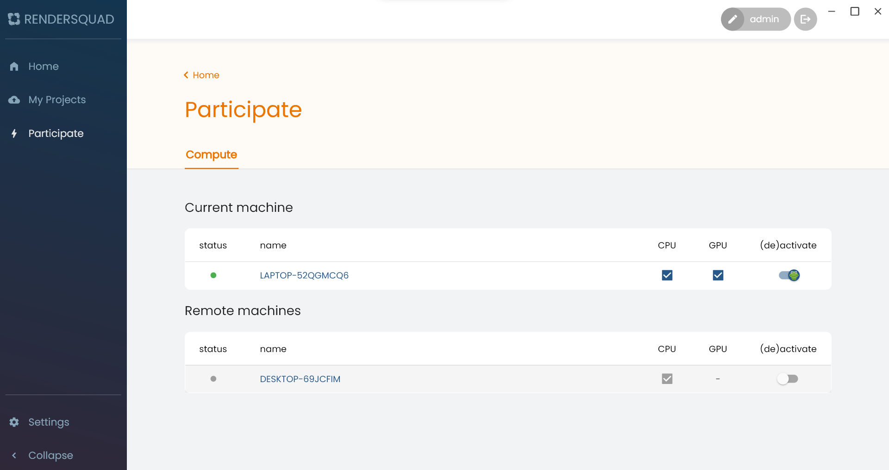
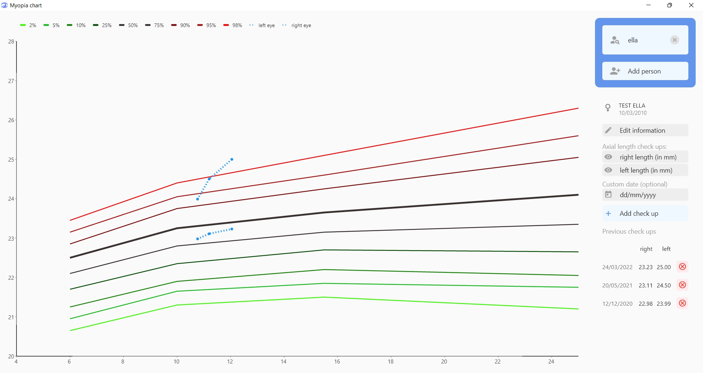
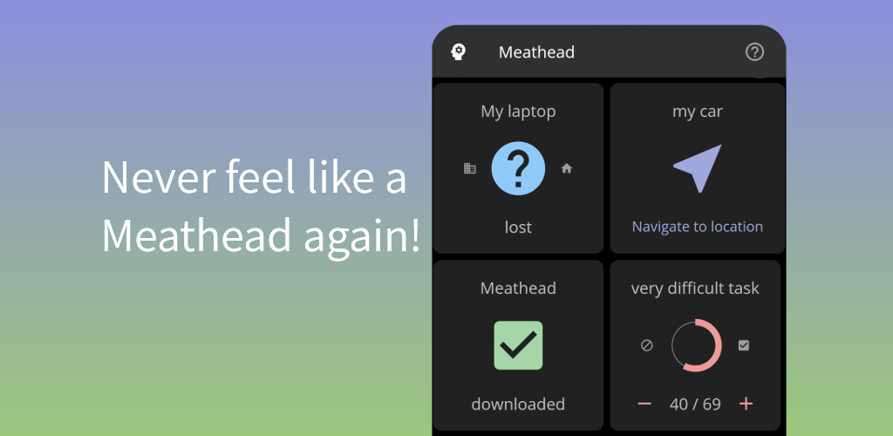
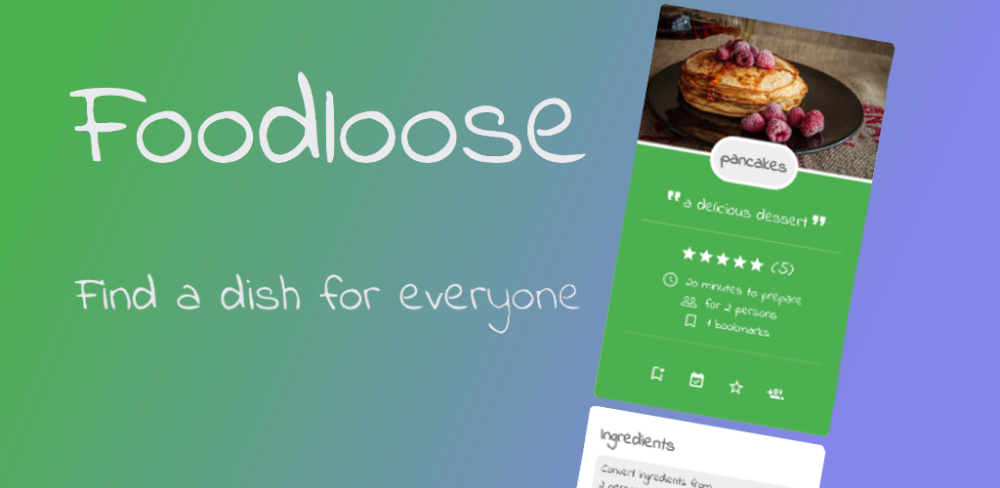

### Hi there, I'm Wouter 👋

## About me
I am a computer science student at KULeuven. In my free time I like to develop Android and Windows applications.

## Personal Projects

### (2022-2023) Rendersquad
A Windows based application for rendering complex 3D scenes in parallel on a distributed network of computers

More info on the [website](https://rendersquad.net)
#### Tech stack:
- frontend: dart + flutter
- backend: AppWrite (extended with dart functions)

### (2022-today) Myopia Chart
A simple Windows application with an online web demo where ophthalmologists can track myopia progression of their patients on two innovative charts.

More info on the [website](https://myopiachart.web.app)

#### Tech stack:
- frontend: dart + flutter

### (2021-2022) Meathead
A simple Android application for tracking progress on personal todo's and saving the location of personal objects like a bike or car.

More info on the [Google Play Store](https://play.google.com/store/apps/details?id=com.wouterlambrecht.meathead)

#### Tech stack:
- frontend: dart + flutter

### (2021) Foodloose
An Android application where users can view and share meals, create a shopping list and plan a meal together with friends.

More info on the [Google Play Store](https://play.google.com/store/apps/details?id=com.wouterlambrecht.foodloose)

#### Tech stack:
- frontend: dart + flutter
- backend: Firebase